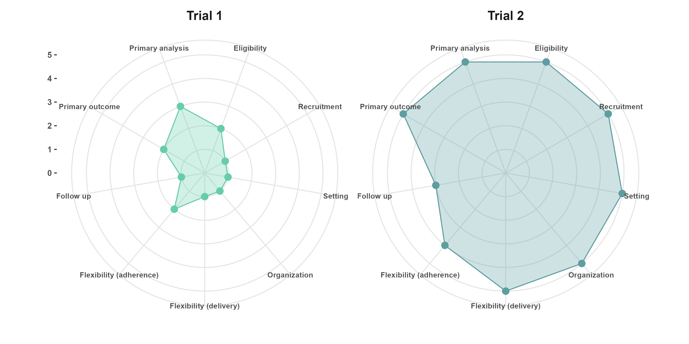

 

  

# PRECIS-2-example

This repository contains an example of the comparison of two hypothetical trials in aging research, one of which is explanatory and the second of which is pragmatic in nature.

# Usage

The code in the [PRECIS-2.R script](/PRECIS-2.R) generates a comparative PRECIS-2 figure of two hypothetical trials. The scoring of PRECIS-2 elements for the two hypothetical trials was done according to the documentation in the [PRECIS-2 website](https://www.precis-2.org/Help/Documentation/Help). You can find an explanation of our rationale for the scoring of these two hypothetical trials in the [Rationale_hypothetical_trials document](/Rationale_hypothetical_trials.docx).

## License

This project is licensed under the terms of the [MIT License](/LICENSE).
